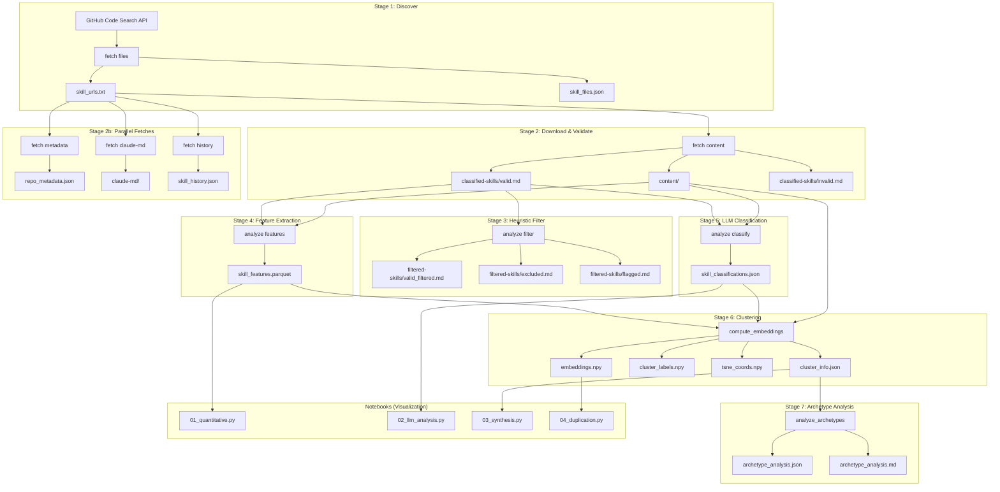

# Data Pipeline Documentation

This document describes the complete data flow for the skill-collection research project, which discovers, validates, classifies, and analyzes SKILL.md files from GitHub.

## Pipeline Overview



## ASCII Fallback Diagram

```
GitHub Code Search API
        |
        v
[Stage 1: fetch files] -----> skill_urls.txt, skill_files.json
        |
        +------+------+------+
        |      |      |      |
        v      v      v      v
[Stage 2: fetch content]  [metadata]  [claude-md]  [history]
        |
        v
content/, classified-skills/{valid,invalid}.md
        |
        v
[Stage 3: analyze filter] --> filtered-skills/{valid_filtered,excluded,flagged}.md
        |
        v
[Stage 4: analyze features] --> skill_features.parquet
        |
        v
[Stage 5: analyze classify] --> skill_classifications.json
        |
        v
[Stage 6: compute_embeddings] --> embeddings.npy, cluster_labels.npy, cluster_info.json
        |
        v
[Stage 7: analyze_archetypes] --> archetype_analysis.json
        |
        v
[Notebooks] --> Visualizations and insights
```

---

## Stage 1: Discover (fetch files)

**Command:** `collect-skills fetch files [--dry-run] [--ranges 0,1,2]`

**Purpose:** Query GitHub Code Search API to find all SKILL.md files.

### Key Challenge: API Result Limit

GitHub Code Search limits results to 1000 per query. To work around this, the pipeline shards queries by file size ranges.

### Algorithm: Adaptive Size-Range Sharding

```python
# models.py:154-193
SIZE_RANGES = [
    SizeRange(0, 99),      # Files 0-99 bytes
    SizeRange(100, 199),   # Files 100-199 bytes
    # ... 38 ranges total
    SizeRange(100000, None),  # Unbounded upper range
]
```

The collection loop (`cli.py:90-174`):

1. Process each size range sequentially
2. If a range returns >1000 results, subdivide it:
   - Bounded ranges: split at midpoint (`SizeRange.subdivide()`)
   - Unbounded ranges: double the lower bound (exponential exploration)
3. Adaptive chunk sizing: shrink after hitting limits, grow after consecutive successes

### Deduplication

Files are deduplicated by SHA hash (`collect.py:112-126`):
```python
def deduplicate_items(items, seen_shas):
    unique = []
    for item in items:
        sha = item.get("sha")
        if sha and sha not in seen_shas:
            seen_shas.add(sha)
            unique.append(extract_file_info(item))
    return unique, seen_shas
```

### Output Files

| File | Format | Schema |
|------|--------|--------|
| `skill_urls.txt` | Text | One GitHub blob URL per line |
| `skill_files.json` | JSON | Array of `FileInfo` objects |
| `summary.json` | JSON | Collection metadata with shard stats |
| `progress.md` | Markdown | Live progress table |

**FileInfo schema:**
```json
{
  "name": "SKILL.md",
  "path": "path/to/SKILL.md",
  "sha": "abc123...",
  "html_url": "https://github.com/owner/repo/blob/ref/path/SKILL.md",
  "repository": {
    "full_name": "owner/repo",
    "html_url": "https://github.com/owner/repo",
    "description": "Repo description"
  }
}
```

---

## Stage 2: Download & Validate (fetch content)

**Command:** `collect-skills fetch content [--limit N] [--skip-validation] [--validation-concurrency N]`

**Purpose:** Download file content from GitHub and optionally validate with Claude.

### Process Flow

1. Load URLs from `skill_urls.txt`
2. For each URL:
   - Parse GitHub URL into `(owner, repo, ref, path)`
   - Check if content already cached locally
   - If not cached: fetch via GitHub Contents API
   - Save to `content/{owner}/{repo}/blob/{ref}/{path}`
3. If validation enabled:
   - Send content to Claude for classification
   - Write to `valid.md` or `invalid.md`

### Symlink Resolution

Git stores symlinks as small text files containing a relative path. The pipeline detects and resolves these (`filter.py:24-68`):

```python
def is_symlink_content(content: str) -> bool:
    content = content.strip()
    if "\n" in content or len(content) > 200:
        return False
    if "/" not in content and not content.startswith(".."):
        return False
    return "{{" not in content  # Exclude template syntax
```

Resolved URLs are tracked in the output with a symlink marker column.

### Claude Validation Prompt

```
Analyze this file and determine if it is a valid Claude Code SKILL.md file.

A valid SKILL.md file should:
- Define a skill/capability for Claude Code
- Have clear instructions or prompts
- Not be a generic README or documentation file
- Not be an empty placeholder

Format: {"is_skill_file": true/false, "reason": "brief explanation"}
```

### Output Files

| File | Format | Content |
|------|--------|---------|
| `content/` | Directory tree | Raw file contents mirroring GitHub structure |
| `classified-skills/valid.md` | Markdown table | Valid skills with reasons |
| `classified-skills/invalid.md` | Markdown table | Rejected files with reasons |

---

## Stage 2b: Parallel Metadata Fetches

These commands can run in parallel with Stage 2 (after Stage 1 completes):

### fetch metadata
**Command:** `collect-skills fetch metadata [--limit N] [--concurrency N]`

Fetches repository metadata (stars, forks, language, creation date) via GitHub API.
- Output: `repo_metadata.json`

### fetch claude-md
**Command:** `collect-skills fetch claude-md [--limit N] [--concurrency N]`

Fetches `CLAUDE.md` files from repositories that have SKILL.md files.
- Output: `claude-md/{owner}/{repo}/CLAUDE.md`

### fetch history
**Command:** `collect-skills fetch history [--limit N] [--concurrency N]`

Fetches commit history for each skill file.
- Output: `skill_history.json`

---

## Stage 3: Heuristic Filter (analyze filter)

**Command:** `collect-skills analyze filter [--dry-run]`

**Purpose:** Remove test fixtures, template stubs, and low-quality files using heuristics.

### Tier 1 Filters (Auto-Exclude)

| Filter | Pattern | Rationale |
|--------|---------|-----------|
| Test paths | `/tests?/`, `/fixtures?/`, `/test_data/`, `/_?demo/` | Test infrastructure files |
| Template stubs | `{{ includeTemplate`, `{% include`, `$(ARGUMENTS)` | Chezmoi/Jinja templates |
| Generic test names | `test-skill`, `minimal-skill`, `example-skill`, etc. | Placeholder names |
| Extremely small | <100 bytes | Not enough content |

### Tier 2 Flags (Review Needed)

| Condition | Threshold | Rationale |
|-----------|-----------|-----------|
| Small + no frontmatter | <200 bytes && no frontmatter | May be incomplete |
| Very few words | <10 words | Likely placeholder |

### Output Files

| File | Content |
|------|---------|
| `filtered-skills/valid_filtered.md` | Skills that passed all filters |
| `filtered-skills/excluded.md` | Auto-excluded with reasons |
| `filtered-skills/flagged.md` | Flagged for manual review |

---

## Stage 4: Feature Extraction (analyze features)

**Command:** `collect-skills analyze features`

**Purpose:** Extract quantitative features from each skill file for statistical analysis.

### Extracted Features

**Basic Statistics:**
| Feature | Description |
|---------|-------------|
| `byte_size` | Raw file size in bytes |
| `char_count` | Character count |
| `word_count` | Word count (whitespace-split) |
| `line_count` | Line count |
| `paragraph_count` | Paragraphs (blank-line separated) |
| `reading_level` | Flesch-Kincaid Grade Level |

**Flesch-Kincaid Formula (`analyze.py:153-159`):**
```
FK = 0.39 × (words/sentences) + 11.8 × (syllables/words) - 15.59
```

**Frontmatter Analysis:**
| Feature | Description |
|---------|-------------|
| `has_frontmatter` | YAML frontmatter present |
| `frontmatter_bytes` | Size of frontmatter block |
| `has_name` | `name` field in frontmatter |
| `has_description` | `description` field |
| `has_triggers` | `triggers` field |
| `has_model` | `model` field |
| `has_allowed_tools` | `allowed-tools` field |
| `has_user_invocable` | `user-invocable` field |

**Content Structure:**
| Feature | Description |
|---------|-------------|
| `has_h1` | Contains H1 heading |
| `heading_count` | Total headings (any level) |
| `code_block_count` | Fenced code blocks |
| `code_language_count` | Unique languages in code blocks |
| `list_item_count` | Bullet + numbered items |
| `table_count` | Markdown tables |
| `link_count` | Markdown links |
| `external_url_count` | Links to http(s) URLs |

**Content Patterns:**
| Feature | Detection |
|---------|-----------|
| `has_examples` | "example", "usage", "sample" or code blocks |
| `has_when_to_use` | "when to use/activate", "trigger", "invoke" |
| `has_references` | "reference", "see also", "documentation", or external URLs |

### Output File

**`skill_features.parquet`** - Polars DataFrame with one row per skill, ~30 columns.

---

## Stage 5: LLM Classification (analyze classify)

**Command:** `collect-skills analyze classify [-o OUTPUT] [--limit N] [--concurrency N]`

**Purpose:** Use Claude to extract rich semantic taxonomy for each skill.

### Classification Schema (`classify.py:30-46`)

```json
{
  "summary": "1-sentence description",
  "primary_purpose": "teaching|automation|enforcement|documentation|debugging|refactoring|integration|meta",
  "knowledge_domain": "framework|language|tooling|architecture|process|meta|general",
  "domain_specifics": ["zod", "typescript", ...],
  "scope": "universal|language-bound|framework-bound|project-specific",
  "trigger_mechanism": "keyword|intent|context|manual|always-on|unknown",
  "claude_role": "generator|advisor|enforcer|teacher|translator|mixed",
  "output_modality": ["code", "commands", "files", "text", "structured"],
  "sophistication": "minimal|standard|comprehensive|system-grade",
  "has_examples": true,
  "has_explicit_rules": true,
  "has_external_refs": true,
  "quality_score": 1-5,
  "notable_features": [...],
  "anti_patterns": [...]
}
```

### Taxonomy Values

**primary_purpose:**
- `teaching` - Explains concepts, best practices
- `automation` - Generates code/files, runs commands
- `enforcement` - Code style, conventions, quality gates
- `documentation` - Generates docs, changelogs
- `debugging` - Troubleshooting, error handling
- `refactoring` - Code transformation patterns
- `integration` - Connects tools, APIs, services
- `meta` - About Claude Code itself, skill authoring

**sophistication:**
- `minimal` - Few lines, simple reminder
- `standard` - Clear structure, some examples
- `comprehensive` - Multiple sections, extensive examples
- `system-grade` - Complex workflows, error handling

### Output File

**`skill_classifications.json`** - Array of classification objects, one per skill:
```json
[
  {
    "url": "https://github.com/owner/repo/blob/ref/SKILL.md",
    "summary": "...",
    "primary_purpose": "automation",
    ...
  }
]
```

---

## Stage 6: Clustering (compute_embeddings)

**Command:** `uv run python -m skill_collection.compute_embeddings`

**Purpose:** Compute semantic embeddings and identify skill archetypes via clustering.

### Algorithm

1. **Embedding:** Use `all-MiniLM-L6-v2` (sentence-transformers) to embed full skill content
2. **Clustering:** OPTICS algorithm with `min_samples=3`, `xi=0.02`, `min_cluster_size=5`
3. **Visualization:** t-SNE projection (sampled to 1500 points for performance)

### OPTICS Parameters (`compute_embeddings.py:63-65`)

```python
clusterer = OPTICS(min_samples=3, xi=0.02, min_cluster_size=5)
```

- `min_samples=3`: Minimum 3 neighbors for core point (handles sparse data)
- `xi=0.02`: Steepness threshold for cluster extraction (lower = more clusters)
- `min_cluster_size=5`: Minimum cluster size to report

### Output Files

| File | Format | Shape/Content |
|------|--------|---------------|
| `embeddings.npy` | NumPy float32 | `(n_skills, 384)` |
| `embedding_urls.json` | JSON | URL list matching embedding order |
| `cluster_labels.npy` | NumPy int32 | `(n_skills,)` cluster labels (-1 = outlier) |
| `tsne_coords.npy` | NumPy float32 | `(n_sampled, 2)` for visualization |
| `tsne_indices.npy` | NumPy int32 | Indices into embeddings for sampled points |
| `cluster_info.json` | JSON | Cluster summaries (see below) |

### cluster_info.json Schema

```json
{
  "clusters": [
    {
      "label": 0,
      "size": 42,
      "dominant_purpose": "automation",
      "purity": 0.85,
      "members": [
        {
          "idx": 123,
          "url": "...",
          "content": "truncated...",
          "repo": "owner/repo",
          "word_count": 250
        }
      ],
      "purpose_dist": {"automation": 36, "teaching": 6}
    }
  ],
  "outliers": [...],
  "n_total": 5000,
  "n_clusters": 45,
  "n_outliers": 1200
}
```

---

## Stage 7: Archetype Analysis (analyze_archetypes)

**Command:** `uv run python -m skill_collection.analyze_archetypes [--limit N]`

**Purpose:** Use Claude to name and describe each cluster archetype qualitatively.

### Analysis Prompt

For each cluster, Claude receives:
- 5 sample skill contents (truncated to 500 chars each)
- Cluster statistics (size, dominant purpose, purity)

Claude returns:
1. **Archetype Name** (2-4 words)
2. **Core Pattern** (what these skills do)
3. **Variations** (differences among samples)
4. **Quality Range** (templates vs. real skills)
5. **Insight** (notable observations)

### Output Files

| File | Format | Content |
|------|--------|---------|
| `archetype_analysis.json` | JSON | Structured analysis per cluster |
| `archetype_analysis.md` | Markdown | Human-readable report |

---

## Caching Architecture

The pipeline uses multiple caching layers to enable resumable processing:

### 1. GitHub API Cache (`github.py`)

**Location:** `.cache/` (project root)
**Key:** SHA256 of `{endpoint}|{params}`[:16]
**Format:** JSON files

```python
# github.py:147-165
class Cache:
    def _key(self, endpoint: str, params: dict) -> str:
        key = f"{endpoint}|{json.dumps(params, sort_keys=True)}"
        return hashlib.sha256(key.encode()).hexdigest()[:16]
```

### 2. Content Cache (Filesystem)

**Location:** `results/content/{owner}/{repo}/blob/{ref}/{path}`
**Key:** GitHub URL structure
**Format:** Raw file content

Files are only re-fetched if missing. Stage 2 checks `local_path.exists()` before API calls.

### 3. Classification Cache (`cache.py`)

**Location:** `results/.classify_cache/`
**Key:** SHA256 of full prompt text[:16]
**Format:** JSON with classification result

Used by both `filter.py` (validation) and `classify.py` (taxonomy extraction).

### 4. Taxonomy Cache

**Location:** `results/.taxonomy_cache/`
**Key:** SHA256 of classification prompt[:16]
**Format:** JSON with taxonomy result

### Cache Invalidation

- `--skip-cache` flag bypasses reading (still writes)
- Delete `.cache/` or `.*_cache/` directories to force refresh
- Content cache must be manually deleted to re-fetch files

---

## Key Source Files

| Module | Path | Key Functions |
|--------|------|---------------|
| CLI | `cli.py` | `cmd_fetch_files`, `cmd_fetch_content`, `dispatch_*` |
| Collection | `collect.py` | `collect_shard`, `needs_subdivision`, `deduplicate_items` |
| Models | `models.py` | `SizeRange`, `ShardResult`, `SIZE_RANGES` |
| GitHub | `github.py` | `GitHubClient.api`, `RateLimiter`, `Cache` |
| Validation | `filter.py` | `validate_skill_content`, `is_symlink_content` |
| Heuristic Filter | `filter_invalid.py` | `filter_skill`, tier patterns |
| Features | `analyze.py` | `extract_features`, `count_syllables` |
| Taxonomy | `classify.py` | `classify_skill`, `CLASSIFICATION_SCHEMA` |
| LLM Wrapper | `agent.py` | `query_json`, `_parse_json_response` |
| Embeddings | `compute_embeddings.py` | OPTICS, t-SNE, cluster info |
| Archetypes | `analyze_archetypes.py` | `analyze_archetype` |
| Cache | `cache.py` | `CacheManager` |
| Utils | `utils.py` | `parse_github_url`, `resolve_content_path` |

---

## Running the Full Pipeline

```bash
# Stage 1: Discover
uv run collect-skills fetch files

# Stage 2: Download & Validate
uv run collect-skills fetch content

# Stage 2b: Parallel metadata (optional)
uv run collect-skills fetch metadata &
uv run collect-skills fetch claude-md &
uv run collect-skills fetch history &
wait

# Stage 3: Heuristic Filter
uv run collect-skills analyze filter

# Stage 4: Feature Extraction
uv run collect-skills analyze features

# Stage 5: LLM Classification
uv run collect-skills analyze classify --concurrency 3

# Stage 6: Clustering
uv run python -m skill_collection.compute_embeddings

# Stage 7: Archetype Analysis
uv run python -m skill_collection.analyze_archetypes --limit 20
```

---

## Performance Considerations

### GitHub API Rate Limits

The pipeline uses separate rate limiters for different endpoints (`github.py:14-27`):

| Endpoint | Limit | Used |
|----------|-------|------|
| Search | 10/min | 8/min |
| Contents | 5000/hour | 60/min |
| Default | 5000/hour | 60/min |

Adaptive backoff reduces rate by 25% on each limit hit (`BACKOFF_FACTOR = 0.75`).

### Concurrency

- **fetch content:** Concurrent downloads, serial validation by default
- **analyze classify:** `--concurrency N` for parallel LLM calls
- **compute_embeddings:** Single-threaded (sentence-transformers parallelizes internally)

### Memory Usage

- **embeddings.npy:** ~7MB per 5000 skills (384 × 5000 × 4 bytes)
- **t-SNE:** Limited to 1500 points to avoid memory issues
- **content loading:** Streams through files, doesn't hold all in memory
