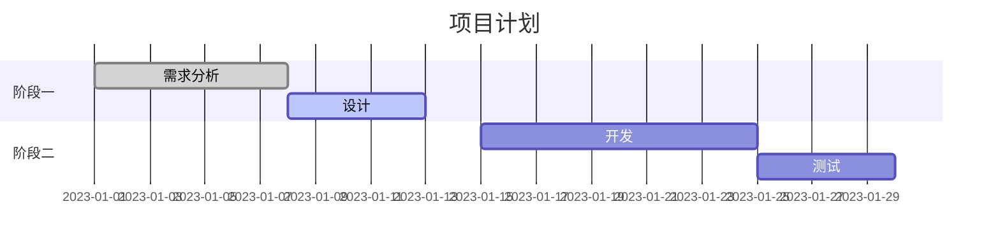

# 数学

```mermaid
gantt
    title 项目计划
    dateFormat  YYYY-MM-DD
    section 阶段一
    需求分析       :done,    des1, 2023-01-01, 7d
    设计           :active,  des2, 2023-01-08, 5d
    section 阶段二
    开发           :         des3, 2023-01-15, 10d
    测试           :         des4, 2023-01-25, 5d
```